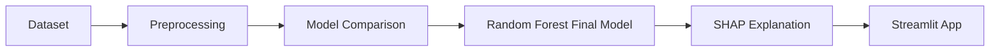

# Pediatric BMT Success Predictor

A decision-support application developed to assist physicians in predicting the success rate of bone marrow transplants in pediatric patients. This project combines machine learning, SHAP explainability, and a Streamlit interface to provide transparent clinical decision support.

---

## Visual Summary

> **Goal:** predict pediatric bone marrow transplant survival using an explainable ML pipeline.
>
> **Best model:** **Random Forest**
>
> **Main strengths:** class-imbalance handling, SHAP interpretability, reproducible workflow, physician-oriented interface.



---

## Project Overview

The objective of this project is to build an accurate, interpretable, and reproducible medical decision-support system for pediatric bone marrow transplant survival prediction.

The application:
- predicts transplant success probability,
- explains predictions with SHAP,
- helps physicians understand the factors driving predictions,
- follows a structured machine learning workflow from preprocessing to deployment.

---

## Dataset

This project uses the **Pediatric Bone Marrow Transplant Children** dataset from the UCI Machine Learning Repository.

The dataset contains pre-transplant and transplant-related clinical variables describing:
- donor and recipient demographics,
- disease and risk characteristics,
- compatibility indicators,
- transplant procedure information.

Our target variable is **`survival_status`**.

---

## Task Management (Trello)

To manage team coordination and track the project workflow, we used Trello as recommended in the project brief.

**Trello board:** [Health Project Board](https://trello.com/invite/b/69aecd8a77da1cab8b19330c/ATTIbeffe79b3bda32c3e5ff6dac11a00f5729779811/health)

The board was used to organize and monitor tasks such as:
- data preprocessing,
- class imbalance handling,
- model training and comparison,
- SHAP integration,
- Streamlit interface development,
- README writing and final review.

We tracked progress using a simple workflow:
- **To Do**
- **In Progress**
- **Review**
- **Done**

This helped make responsibilities clear and kept the project traceable from start to finish.

---

## Class Balance

The dataset is **moderately imbalanced**, with about **60% survival** and **40% non-survival** cases.

To address this, we used **class-weight adjustment** instead of SMOTE or undersampling.

Why this choice:
- undersampling would remove valuable medical observations,
- synthetic oversampling may introduce artificial patterns,
- class weights preserve the original dataset while improving minority-class learning.

### Visual


### Impact

This choice improved the reliability of **precision**, **recall**, **F1-score**, and **ROC-AUC**, which are more informative than accuracy alone in a medical classification problem.

---

## Best Model and Performance

After preprocessing the data and removing leakage features, **Random Forest** emerged as the best-performing model on the leakage-free dataset.

### Final Metrics

| Model | Accuracy | ROC-AUC | Precision | Recall | F1-Score |
|------|----------|---------|-----------|--------|----------|
| **Random Forest** | **0.947** | **0.968** | **1.000** | **0.882** | **0.938** |
| XGBoost | 0.895 | 0.964 | 0.882 | 0.882 | 0.882 |
| SVM | 0.526 | 0.759 | 0.455 | 0.294 | 0.357 |

### Visuals


### Why Random Forest?

Random Forest achieved the strongest overall performance on the leakage-free dataset. It provided the best balance between discrimination ability, precision, recall, and robustness on tabular clinical data.

### Why ROC-AUC?

We prioritized **ROC-AUC** because it evaluates the model’s ability to separate survivors from non-survivors across thresholds, making it more reliable than raw accuracy in an imbalanced medical setting.

---

## Most Influential Medical Features (SHAP)

According to the SHAP analysis, the most influential pre-transplant predictors were:
- **Risk group**
- **Recipient age and donor age**
- **HLA compatibility**
- **Stem cell source**
- **Disease category**
- **Gender match**
- **CMV status**
- **CD34+ cell dose**

These variables are clinically meaningful because they reflect key risk, compatibility, and transplant-related factors considered before treatment.

### Visuals


---

## Data Analysis and Feature Selection

We initially started with **36 features** describing donor and recipient characteristics, the transplant procedure, and post-transplant clinical outcomes. To build a robust predictive model, our goal was to maximize performance while eliminating noise, redundancy, and information leakage.

### Main preprocessing decisions

1. **Preventing data leakage**  
   We removed all variables recording events occurring after the transplant, such as acute GvHD variables and survival time.

2. **Removing redundant variables**  
   We kept continuous age variables (`Donorage`, `Recipientage`) instead of grouped thresholds (`Donorage35`, `Recipientage10`, `Recipientageint`).

3. **Simplifying compatibility variables**  
   We reduced overlap among HLA-related features (`HLAmatch`, `HLAmismatch`, `Antigen`, `Allele`, `HLAgrI`) to improve stability and interpretability.

4. **Handling missing values**  
   Features with extremely high missingness were dropped when unreliable; the remaining missing values were imputed to preserve patient records.

5. **Reducing biological redundancy**  
   Among related dose variables such as `CD34kgx10d6`, `CD3dkgx10d8`, and `CD3dCD34`, we retained `CD34kgx10d6` as the main representative feature.

---

## Correlation Analysis

This section is designed to be understood **visually first**, especially for readers who want to grasp the preprocessing logic quickly.

### Correlation Heatmap


### Key Correlated Pairs

| Feature Pair | Correlation | Decision |
|---|---:|---|
| `aGvHDIIIIV` ↔ `time_to_aGvHD_III_IV` | **0.969** | treated as highly redundant / post-transplant information |
| `HLAmatch` ↔ `HLAgrI` | **0.947** | simplified compatibility representation |
| `Recipientageint` ↔ `Recipientage` | **0.917** | kept `Recipientage`, dropped grouped age version |
| `Allele` ↔ `HLAmatch` | **0.904** | reduced redundancy among HLA descriptors |

### Interpretation in One Look

- strong correlations reveal **duplicated or overlapping information**,
- keeping all of them would increase **redundancy**,
- we kept the **most interpretable and clinically meaningful** variables,
- this improved **model clarity**, **stability**, and **SHAP interpretability**.

### Correlation Decision Summary

We did not use the correlation matrix only as a descriptive plot. We used it to **guide feature selection** and avoid giving too much weight to repeated information.

---

## Prompt Engineering Insights

Prompt engineering was useful for debugging technical issues and accelerating preprocessing and implementation.

It helped us:
- resolve SHAP compatibility issues,
- generate data parsing and preprocessing logic,
- improve missing-value handling,
- generate memory optimization code,
- stabilize the evaluation pipeline.

### Example Prompt 1

**Prompt used:**  
`Write a Python function optimize_memory(df) that reduces memory usage by converting numeric columns to smaller valid dtypes without changing the data values.`

**Result obtained:**  
A reusable function that downcasted integer and float columns and helped demonstrate memory reduction before and after optimization.

**Insight:**  
A precise and task-specific prompt produced directly usable code.

### Example Prompt 2

**Prompt used:**  
`Help me debug a SHAP TreeExplainer dimensionality error after updating the SHAP library. Adapt the code so it works whether shap_values is returned as a list or a 3D NumPy array.`

**Result obtained:**  
A more robust SHAP plotting block compatible with different SHAP outputs.

**Insight:**  
Iterative prompting was especially effective for solving version-related debugging issues.

---

## App Interface

The final application allows physicians to:
- enter clinical and patient information,
- obtain a survival prediction,
- visualize SHAP-based explanations.

### Screenshot


---

## Reproducibility

This project is fully reproducible.

### 1. Install dependencies
```bash
pip install -r requirements.txt
```

### 2. Train the model
```bash
python src/train_model.py
```

### 3. Run the app
```bash
streamlit run app/app.py
```

---

## Notes

- SHAP improves transparency and trust in predictions.
- The system is designed for **decision support**, not to replace clinical judgment.
- The README is intentionally **visual-first**, especially for class balance, model comparison, correlation analysis, and SHAP interpretation.
